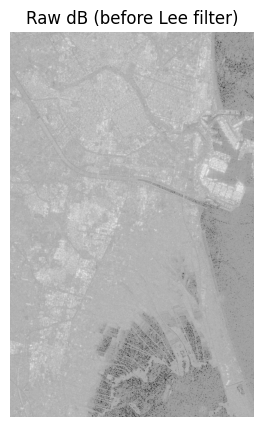
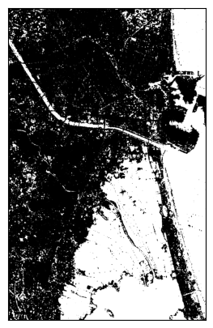
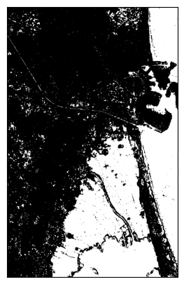
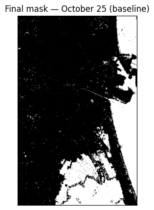
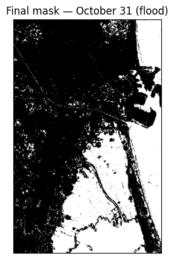
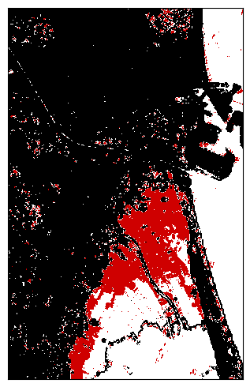
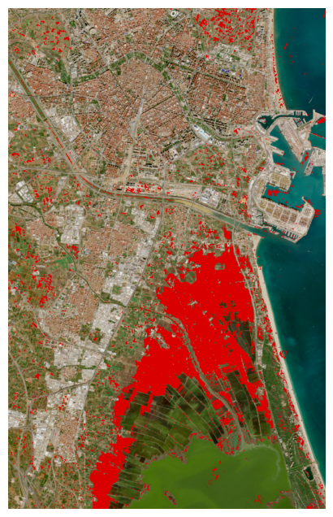

# Flood Extent Detection
An end-to-end Python pipeline that detects flood extent from raw Sentinel-1 SAR imagery and outputs a vectorized flood extent map, implementing adaptive despeckling (Lee filter [[1]](#references)), Otsu segmentation [[2]](#references), and DEM-based terrain correction.

This project was built to explore how satellite data can be used for earth observation tasks such as flood detection, usage of SAR imagery and remote-sensing techniques by implementing each processing step myself rather than relying on existing tools to 

## Setup & Usage

1. Install the required dependencies:

```bash
pip install -r requirements.txt
```

2. To run the tool on an area of your choice you need a baseline SAR file, a during flooding file and a DEM file of the area. For example, to produce the Valencia results shown above:

```bash
python flood_detection.py example-data/2024-10-25-Sentinel1-Valencia(Raw).tiff example-data/2024-10-31-Sentinel1-Valencia(Raw).tiff example-data/DEM_COPERNICUS_Valencia(Raw)
```
The result will then be saved to the folder in GeoJSON format . 
<br>

## Pipeline: Example results - Valencia, October 2024 ([Spanish Floods](https://en.wikipedia.org/wiki/2024_Spanish_floods))
### 1. Despeckling
Raw SAR imagery is affected by speckle noise, a noise pattern that exists in radar images due to interference of the returning electromagnetic waves scattered from multiple surfaces. Filtering modules reduce speckle noise while preserving real edges and smoothing the flat areas. Several despeckling filters exist including, Frost, Kuan, Lee and Enhanced Lee, among others. This project applies Lee filter. 

<table><tr>
<td align="center">
  <b>Before Lee filter</b><br/>
  
</td>
<td align="center">
  <b>After Lee filter</b><br/>
  
</td>
</tr></table>

### 2. Water segmentation
Otsu's method is an algorithm that finds the threshold that best seperates pixels into two classes - in this case water (white) and land (black) - based on the scene's brightness histogram.

<div align="center">
  <p align="center"><b>Only Otsu applied mask</b></p>
  
</div>

### 3. Terrain correction
Steep terrain facing away from the radar returns little radar, a phenomenon called radar shadow, which can be mistaken for calm water. A DEM derived slope mask filters these false positives out; the final mask is a combination of the Otsu-derived water mask with this slope mask.

<div align="center">
  <p align="center"><b>Otsu + slope correction mask</b></p>
  
</div>

### 4. Comparison of before and after the flooding
The pipeline is run on a pre-flood baseline scene and a during/after-flood sccene. Water present in the second but not the first counts as flooding. The images below show both scenes' final masks, as well as the resulting flood extent - existing water shown in white, newly flooded areas in red.

<table><tr>
<td align="center">
  <p align="center"><b>Baseline (25/10/2024)</b></p>
  
</td>
<td align="center">
  <p align="center"><b>During flood (31/10/2024)</b></p>
  
</td>
<td align="center">
  <p align="center"><b>Flood extent</b></p>
  
</td>
</tr></table>

### 5. Real-world image: 
For visual context, the detected flood extent is overlaid in red on a true-color on Sentinel 2 image of the same area from a cloud-free date. 

<div align="center">
  <p align="center"><b>Flood extent on Sentinel 2 image</b><br/></p>
  
</div>


## References
[1] J. -S. Lee, "Digital Image Enhancement and Noise Filtering by Use of Local Statistics," *IEEE Transactions on Pattern Analysis and Machine Intelligence*, vol. PAMI-2, no. 2, pp. 165-168, March 1980, doi: [10.1109/TPAMI.1980.4766994](https://doi.org/10.1109/TPAMI.1980.4766994)

[2] N. Otsu, "A Threshold Selection Method from Gray-Level Histograms," *IEEE Transactions on Systems, Man, and Cybernetics*, vol. 9, no. 1, pp. 62-66, Jan. 1979, doi: [10.1109/TSMC.1979.4310076](https://doi.org/10.1109/TSMC.1979.4310076)
